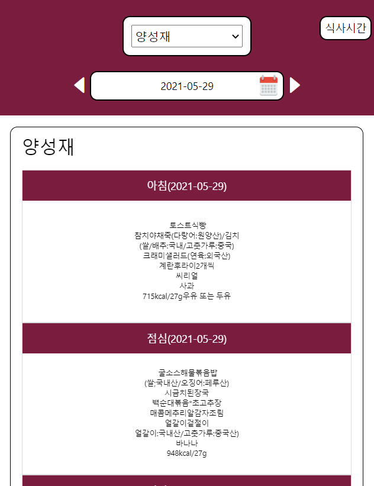

## 충북대학교 기숙사식단 알리미

충북대학교 기숙사(양진재, 양성재, 개성재) 식단을 앱으로 작성하기 위해
제작되었습니다.

## Goal

1. 오늘 일자 기준으로 기숙사 식단 load 
2. 상단의 select box를 통해 기숙사 선택
- local DB => AsyncStorage에 저장
- AsyncStorage에 값이 있는 경우, 해당 기숙사의 정보의 식단만 load
3. 상단의 날짜 input box에서 날짜 선택 후 기숙사   

## Download
- Android
    - https://play.google.com/store/apps/details?id=com.boatman.cbnuDomotoryApp
 
